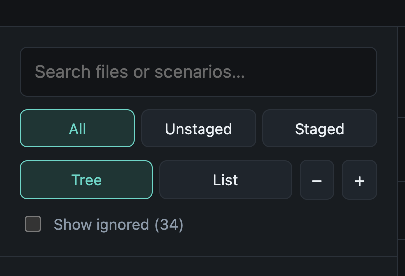
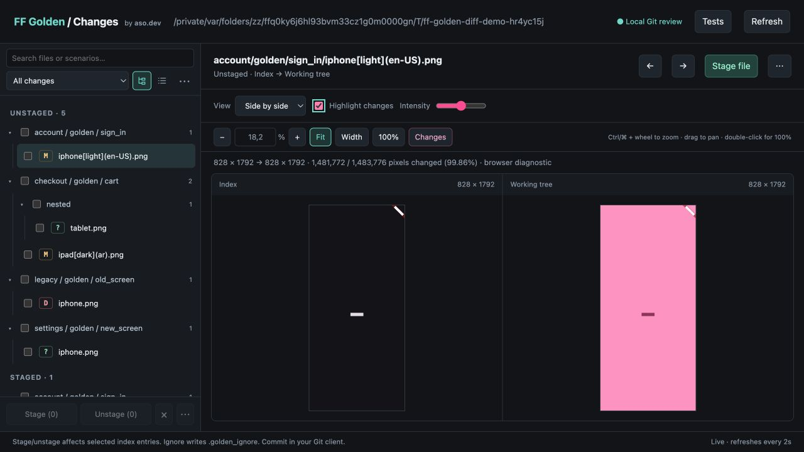
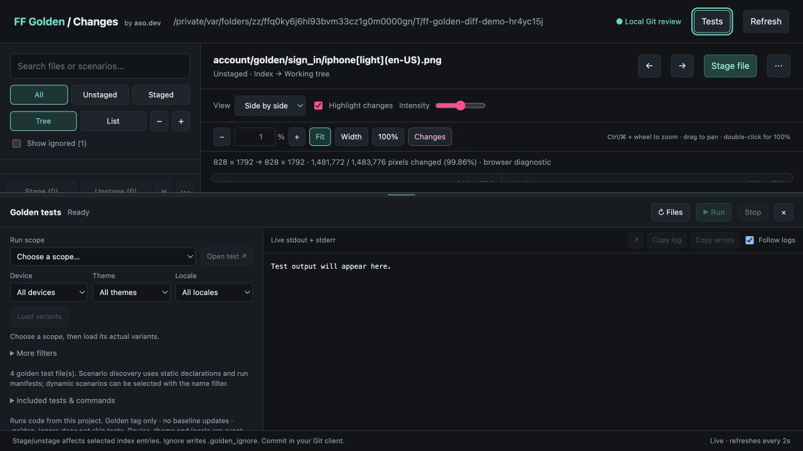
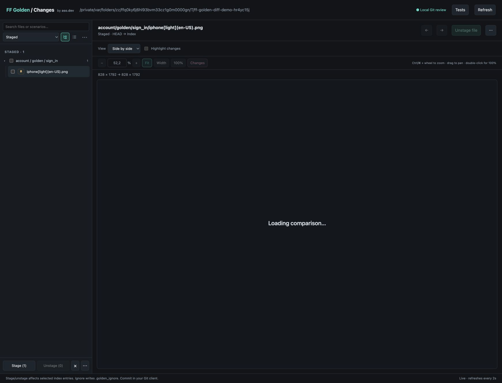

# FF Golden Changes — UI/UX-аудит

Дата: 31 августа 2026. Объект: локальный `ff_golden_presenter diff`.

**Основной вывод:** продукт уже закрывает полезный цикл «найти изменение →
сравнить → запустить тест → разобраться → подготовить Git index». Следующая
итерация должна улучшить распределение места, ясность области действия и
навигацию по результатам. Новое нативное приложение для этого не требуется.

По дополнительной просьбе пользователя компактная панель файлов уже реализована.
Остальные рекомендации ниже — результат исследования, а не выполненные изменения.

## Метод и ограничения

- Осмотр работающего viewer, DOM, размеров элементов и исходников; проходы по
  фильтрам Git, дереву/списку, ignored, сравнению, контекстным меню и панели тестов.
- Проверка размеров 1280×720 и 800×700 CSS px. Для компактных контролов проверены
  клавиатура, возврат фокуса и границы раскрытого меню.
- Использован отдельный демо-репозиторий: 6 записей изменений в начальном списке,
  1 ignored-файл и 4 тестовых файла. Скриншот пользователя дополнительно
  подтверждает тот же перегруженный блок с 34 ignored-файлами.
- Сопоставление с публичной документацией Fork, Chromatic, VS Code, W3C и NN/g.
  Это анализ паттернов, а не тестирование установленных приложений конкурентов.
- Это экспертный аудит, **не исследование с респондентами**. Частота операций,
  экономия времени и поведение на тысячах файлов не измерялись. Производственный
  проект ASO.dev в этом аудите не запускался, эталонные изображения не обновлялись.

## Что уже изменено: компактная панель файлов

| Параметр | До | После |
|---|---:|---:|
| Высота блока при ширине sidebar 319 px | 185,99 px | 83 px |
| Постоянные строки управления | 4 | 2 |
| Освобождённое место для списка | — | 103 px, примерно 55% высоты блока |
| Tree / List / ⋯ | Крупные текстовые кнопки и отдельные действия | Иконки с областью клика 30×30 px |
| Показ ignored | Постоянная отдельная строка | Пункт меню; видимая метка при включении |
| При sidebar 240 px | — | 83 px высоты, горизонтального переполнения нет |

Первая строка — поиск. Вторая — Git-фильтр `All changes / Unstaged / Staged`,
Tree/List и `⋯`. В меню находятся Collapse all folders, Expand all folders и
Show ignored с количеством файлов. В List команды папок недоступны. Когда
ignored показаны, рядом с поиском появляется `+ ignored (N) ×`; метка возвращает
обычный список одним кликом.

Компромисс: смена Git-фильтра теперь требует открытия select, вместо прямого
клика по одной из трёх кнопок. Для запрошенной плотности это разумный первый
вариант. Если наблюдение покажет очень частое переключение Staged/Unstaged,
стоит вернуть компактные текстовые сегменты, переместив режим вида в меню.

До — фрагмент со скриншота пользователя. Масштаб изображения отличается от
снимка ниже; значения в таблице измерены отдельно в CSS px:



После — работающий viewer при 1280×720 CSS px:



Не уменьшали весь интерфейс масштабированием. Сократили постоянное число
контролов и отступы. По W3C, для указателя предусмотрен минимум 24×24 CSS px
либо оговорённые исключения; новые кнопки 30×30 px дают запас. Это проверка
конкретного блока, не заявление о соответствии всего приложения WCAG.
[W3C: target size](https://www.w3.org/WAI/WCAG22/Understanding/target-size-minimum.html)

## Наблюдения и приоритеты

P1 — заметно мешает основной работе или создаёт риск неверной области действия.
P2 — улучшает скорость и понятность, но основной сценарий доступен.

| Приоритет | Наблюдение | Рекомендация | Статус |
|---|---|---|---|
| P1 | Четыре строки фильтров занимали 186 px над списком | Две строки, вторичные действия в меню, активный ignored виден | Исправлено |
| P1 | При 1280×720 и высоте Tests 380 px область `#viewer` сжимается примерно до 15 px | Минимальная полезная высота сравнения и отдельная команда развернуть Tests | Не изменено |
| P1 | Выделение переживает смену Git-фильтра, но скрытые выбранные файлы не обозначены | Показывать «N выбрано · M вне фильтра» рядом с массовыми действиями | Не изменено |
| P1 | Run scope смешивает проект, папки, файлы и сценарии в длинном select; итог часто описан числом файлов | Поиск по иерархии и краткое резюме файла, сценария, вариантов перед Run | Не изменено |
| P1 | Результат запуска представлен главным образом общим статусом и текстом stdout/stderr | Список результатов с переходом к ошибке, исходнику и повторному запуску | Не изменено |
| P2 | View, zoom, метрики и подсказки занимают несколько полос над изображением | Одна основная полоса, контекстные настройки и вторичные параметры в раскрытии | Не изменено |
| P2 | Git staging, визуальное принятие эталона и `.golden_ignore` имеют разную семантику, объяснение в основном в мелком тексте | Короткие объяснения непосредственно у соответствующих действий | Не изменено |
| P2 | Load variants, запуск и повторная конфигурация делят панель; старый результат остаётся при смене scope | Явно разделить «следующий запуск» и «результат запуска», показывать этап подготовки | Не изменено |

### 1. Панель тестов конкурирует с изображением

При измеренном состоянии открытая панель имеет высоту 380 px, а оставшиеся
фиксированные полосы над canvas почти полностью занимают верхнюю область.
Изменение размера доступно, но пользователь должен сам понять причину и
исправить компоновку. Это особенно заметно на ноутбуке.



Предлагаемый контракт:

- При обычном просмотре изображения сохранять хотя бы 220–240 px полезной
  области сравнения, если размер окна позволяет. Число — проектная цель,
  которую ещё нужно проверить на реальных изображениях.
- Добавить кнопку развернуть/восстановить Tests: полноразмерные логи тогда
  становятся осознанным режимом, а не случайным следствием перетаскивания.
- В компактном состоянии показывать строку состояния последнего запуска;
  подробные фильтры и логи открывать по действию пользователя.
- Не менять автоматически выбранные device/theme/locale ради скорости.

### 2. Скрытое выделение требует явного объяснения

Проверено без изменения Git: выбран один unstaged-файл, затем включён фильтр
Staged. В списке 1 строка и 0 отмеченных файлов, но кнопка `Stage (1)` активна.
Код сохраняет выбор намеренно, что полезно для пакетной работы. Проблема —
в отсутствии объяснения, где находится выбранный объект.



Сохранять выбор, но добавить компактную строку только при непустом выделении:
`1 selected · 1 hidden` с действием Show selection. Контекстное меню должно
продолжать указывать свою область действия. Не добавлять подтверждение на каждый
Stage: это замедлит обычную работу и не исправит непонятное выделение.

### 3. Область запуска должна быть понятна без чтения regex

Текущий preview команды полезен как техническая подробность, но строка
`1 file(s)` не объясняет, что один сценарий может запускаться на 12 вариантах.
После Load variants количество становится известно, до него — нет.

Предлагаемый вид резюме, когда данные действительно загружены:

```text
editor_golden_test.dart › error
6 devices · 2 themes · en · 12 variants
[Run 12 variants]  [Open source]  [Command ▾]
```

Без discovery показывать «количество вариантов не загружено», а не число,
угаданное по имени PNG. Для custom golden-tagged тестов отдельно отмечать, что
списки ff_golden не покрывают все зарегистрированные тесты.

Для большого проекта заменить длинный Run scope на поиск по дереву
«папка → файл → сценарий». При запуске из изображения явно показать, какие
фильтры взяты из manifest и какие пользователь выбрал сам. Подобная иерархия
и действия на узлах используются в Test Explorer VS Code.
[VS Code: testing](https://code.visualstudio.com/docs/debugtest/testing)

### 4. Ошибка должна быть объектом навигации

Copy log / Copy errors и открытие исходника уже полезны. Следующий шаг —
отдельный список результатов: файл, сценарий/вариант, статус, длительность,
причина. При выборе неуспешного результата показать связанный фрагмент лога и
действия Open source, Copy for AI, Rerun. Полный stdout/stderr оставить доступным.

Для достоверных статусов вариантов потребуется структурированный вывод runner,
а не только поиск строк `[E]`. Текущее эвристическое выделение ошибок подходит
для копирования контекста, но не должно становиться источником точных счётчиков.
Нужна отдельная модель состояния для compile/start failure, failed test,
cancelled и no matching tests.

### 5. Уплотнять иерархию, сохраняя главные действия

Для сравнения оставить постоянно видимыми View, Highlight changes, масштаб,
Fit и Changes. Intensity и регулировку смешивания показывать только в подходящем
режиме; подробные метрики и справку — по запросу. Подсветку в side-by-side
сохранить только на новой версии: это уже согласовано с пользователем и
соответствует паттерну Split view в Chromatic.
[Chromatic: Diff Inspector](https://www.chromatic.com/docs/diff-inspector/)

Не переносить Stage, Run или Copy errors исключительно в контекстное меню.
Редкие команды можно раскрывать постепенно, но нужные для текущей задачи
действия должны оставаться обнаруживаемыми. Это применение progressive disclosure,
а не рекомендация уменьшить все шрифты и зоны клика.
[NN/g: Progressive Disclosure](https://www.nngroup.com/articles/progressive-disclosure/)

### 6. Не смешивать разные значения «принять» и «игнорировать»

Stage изменяет Git index; он не делает провалившийся golden-тест успешным.
`.golden_ignore` скрывает изображения только в review; он не отключает тесты.
В текущем продукте нет действия обновления эталонов, и его не стоит имитировать
переименованием Stage в Accept.

В меню Ignore добавить короткое описание «Hide from review · tests still run»,
а после действия — понятный путь к Show ignored / Stop ignoring. Состояние
сравниваемых сторон HEAD / Index / Working tree оставить явным, особенно когда
один путь присутствует и в Staged, и в Unstaged.

## Что полезно взять из референсов

| Источник | Подтверждённый паттерн | Применение здесь |
|---|---|---|
| [Fork](https://www.git-fork.com/) | Image diff и работа с Git в одном клиенте | Сохранять контекст Git вокруг изображения; не копировать весь Git-клиент |
| [Chromatic Diff Inspector](https://www.chromatic.com/docs/diff-inspector/) | Split/unified, подсветка новой версии, фокус на небольших изменениях | Сохранить текущую подсветку; повысить заметность Changes и контекста сторон |
| [VS Code Testing](https://code.visualstudio.com/docs/debugtest/testing) | Дерево тестов, запуск на узлах, переход к исходнику, отдельные результаты | Развести выбор запуска и диагностику; добавить результаты по тестам |
| [W3C menu button](https://www.w3.org/WAI/ARIA/apg/patterns/menu-button/) | Enter/Space, раскрытие, фокус, состояния ARIA | Меню ⋯ должно полноценно работать без мыши |
| [W3C target size](https://www.w3.org/WAI/WCAG22/Understanding/target-size-minimum.html) | Минимальный размер цели либо предусмотренные исключения | Компактность не должна делать кнопки трудными для попадания |
| [NN/g progressive disclosure](https://www.nngroup.com/articles/progressive-disclosure/) | Скрытие вторичных возможностей с сохранением основных | Убирать постоянные пояснения и редкие параметры, не ключевые действия |

## Предлагаемый порядок следующих изменений

1. Ограничить сжатие области сравнения, добавить разворачивание Tests и
   обозначение выбранных файлов вне фильтра. Это не требует нового runner.
2. Сделать резюме запуска с достоверным количеством вариантов и поиск scope.
   Команду оставить раскрываемой технической подробностью.
3. Добавить структурированные результаты, переход к ошибке и точный Rerun.
   После этого оптимизировать очередь файлов, не меняя семантику фильтров.
4. Уплотнить верхнюю полосу сравнения, проверить сохранение настроек и удобство
   клавиатурной навигации на реальном большом наборе файлов.

## Проверки этой итерации

- Все 94 существующих теста presenter прошли; `dart analyze` и
  `git diff --check` без ошибок. Новые тесты, повторяющие CSS-разметку, не добавлялись.
- В браузере: All=6, Unstaged=5, Staged=1; Show ignored добавляет седьмую запись;
  метка отключает его. Stage/Unstage при проверке не вызывались.
- Tree/List переключаются; collapse/expand работают, в List отключены;
  ArrowDown открывает меню, Escape и выбор команды возвращают фокус кнопке.
- Новые иконки 30×30 px. При 800×700 блок остаётся 83 px высотой и не переполняет
  sidebar 240 px. Меню остаётся в пределах окна.
- Прежние ограничения панели Tests и скрытого выделения воспроизведены,
  но намеренно не исправлялись в правке компактной панели.

## Как проверить рекомендации с пользователями

Короткий следующий тест на 3–5 Flutter-разработчиках: найти изменённый сценарий,
проверить одну тему/устройство, понять ошибку, скопировать диагностический контекст,
подготовить только нужный файл к коммиту, затем вернуть ignored-файл в просмотр.

Наблюдать число неверных запусков, ошибочное понимание Stage/Ignore, поиск
потерянного выделения и необходимость вручную перестраивать панели. Предлагаемые
критерии успеха — правильная область запуска до Run, отсутствие неожиданных
массовых действий и доступный canvas при обычном просмотре. Это план проверки,
а не уже полученные результаты исследования.
