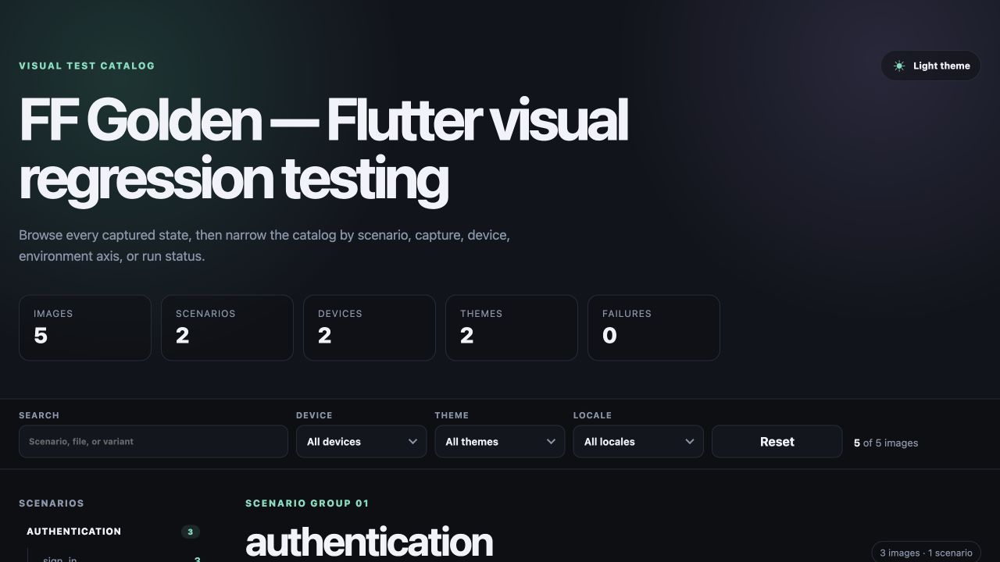
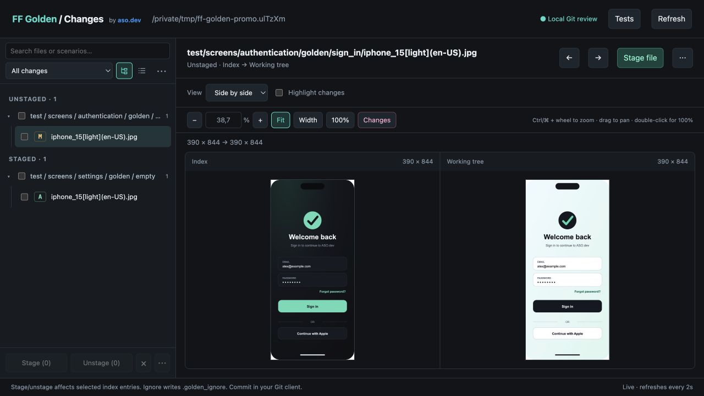

# FF Golden Presenter

[`ff_golden_presenter` on pub.dev](https://pub.dev/packages/ff_golden_presenter) ·
[`ff_golden` runner](https://pub.dev/packages/ff_golden) ·
[Live demo](https://asodevapp.github.io/golden/demo/) ·
[Documentation](https://asodevapp.github.io/golden/presenter/) ·
[GitHub](https://github.com/asodevapp/golden)

FF Golden Presenter is the review and reporting companion to the
[`ff_golden`](https://pub.dev/packages/ff_golden) runner. Review local Git image
changes, run filtered golden tests with live logs, and turn Flutter and Dart
golden images into a searchable, portable HTML report.

The generated page has no runtime dependencies. Open it locally, attach the whole directory to CI, or serve it as a static site. It includes scenario navigation, search and variant filters, remembered light/dark themes, responsive cards, a keyboard-friendly lightbox, and relative image URLs.

## See it in action

**[Open the interactive live report →](https://asodevapp.github.io/golden/demo/)**

[](https://asodevapp.github.io/golden/demo/)

The local `diff` viewer keeps Git state, the file tree, comparison modes, zoom,
test execution, and logs in one browser window:



## Quick start

Add FF Golden Presenter to the Flutter or Dart project that owns the golden
tests as a project-local development dependency:

```shell
flutter pub add --dev ff_golden_presenter
```

Use `dart pub add --dev ff_golden_presenter` in a pure Dart project. Commit the
application pubspec and lockfile so developers and CI resolve the same version.

Build a publication directory from the conventional `test/screens` tree:

```shell
dart run ff_golden_presenter build \
  --input test/screens \
  --manifest build/ff_golden \
  --output-directory build/golden-report \
  --profile balanced \
  --clean
```

The result is self-contained:

```text
build/golden-report/
├── index.html
└── feature/golden/scenario/*.png
```

`--manifest` accepts a schema-v1/v2 `ff_golden.run` file or a directory of
runner shards. The default is `build/ff_golden`; a missing default is harmless.
When manifests are present, the report exposes authoritative capture, device,
theme, locale, text-scale, direction, platform, brightness, contrast, status,
duration, and failure information as searchable badges and filters.

`build` always optimizes the copied files, never the source goldens. The `balanced` profile uses `pngquant` when available and falls back to ImageMagick. Check the machine before the first run:

```shell
dart run ff_golden_presenter doctor --profile balanced
```

To install the compatible tool reported for macOS, Linux, or Windows, opt in explicitly:

```shell
dart run ff_golden_presenter doctor --profile balanced --install-tools
```

No optimizer is required when byte-for-byte copies are preferred:

```shell
dart run ff_golden_presenter build --profile none --clean
```

The equivalent manual dependency is:

```yaml
dev_dependencies:
  ff_golden_presenter: ^1.1.1
```

For an unreleased repository revision, use the package Git source and
`path: packages/ff_golden_presenter`. For a local checkout, use
`path: ../golden/packages/ff_golden_presenter`.

### Renaming from `golden_presenter`

The package and primary executable are now named `ff_golden_presenter` to match the Flutter Files infrastructure family such as `ff_bloc`:

```dart
import 'package:ff_golden_presenter/ff_golden_presenter.dart';
```

```shell
dart run ff_golden_presenter build
```

This is a package-name migration, so update all three surfaces together: the `dev_dependency` key, `package:` imports, and `dart run` command. Dart resolves `dart run golden_presenter` as the old package name; an executable alias inside the renamed package cannot transparently preserve that command.

See [MIGRATION.md](MIGRATION.md) for the complete presenter procedure. After
bootstrapping the new dependency, the CLI can preview, apply, and verify the
deterministic parts:

```shell
dart run ff_golden_presenter migrate --project .
dart run ff_golden_presenter migrate --project . --apply
dart run ff_golden_presenter migrate --project . --check
```

## Actions

Run `dart run ff_golden_presenter --help` for the action list and `<action> --help` for all flags.

| Action | Purpose |
| --- | --- |
| `diff` | Start a local Git image viewer with selected-file stage/unstage. |
| `build` | Collect images, optimize staged PNG files, and create `index.html`. |
| `collect` | Copy supported images recursively while preserving relative paths. |
| `optimize` | Optimize PNG files already in a staging directory. Requires `--in-place`. |
| `report` | Generate only the HTML file from an existing image tree. |
| `doctor` | Detect compatible tools and print a platform-specific install command. |
| `migrate` | Preview/apply safe package renames and report manual migration work. |
| `clean-failures` | Delete generated comparison images below `failures` directories. |

### Local Git image review

Run this from the project whose images you want to review:

```shell
dart run ff_golden_presenter diff
```

The command opens a browser viewer served only on `127.0.0.1`. There is no
separate application to install, no external server, and no generated report
directory. Git must be available on `PATH`. Stop the viewer with **Ctrl-C**.

The sidebar separates **Unstaged** (`index → working tree`, including untracked
images) and **Staged** (`HEAD → index`) changes. A file can appear in both groups
with different image versions. The compact sidebar puts search above the Git
filter (**All changes**, **Unstaged**, **Staged**) and the **Tree** / **List** icon
buttons. **⋯** opens folder expand/collapse commands and **Show ignored**. While
ignored files are visible, a removable **+ ignored (N)** indicator stays beside
search. The tree compacts single-child folders, remembers collapsed folders
during live refresh, and supports selecting a whole folder. Search shows matching
files together with their parent folders.

Select a file and switch between side-by-side, swipe, overlay, and pixel-diff
views. In side-by-side, enable **Highlight changes** to overlay changed pixels on
the new version only, keeping the old version unchanged; the intensity slider
controls the highlight opacity.

Zoom with **− / +**, an editable percentage (1–800%), **Fit**, **Width**, or
**100%**. **Changes** zooms directly to the bounding area of changed pixels.
Ctrl/Cmd + wheel (including trackpad pinch where supported by the browser) zooms
around the cursor. Drag an image to pan; double-click toggles between 100% at the
clicked point and Fit. The two side-by-side images share zoom and scroll position.
Keyboard shortcuts outside controls: `+` / `−` to zoom, `0` for Fit, `1` for 100%,
and arrow keys for previous/next images. Changes refresh every two seconds while
the tab is visible.

Use **Stage file / Unstage file** for the active image or **Stage (N) / Unstage (N)**
below the sidebar for checked images. The **×** button clears the selection.
These actions only change the selected index entries;
they do not rewrite working images, discard changes, commit, or push. Existing
staged changes outside the selection are preserved. Stale selections are rejected
and must be reviewed again. Finish the commit in your usual Git client.

Right-click a file, folder, or image preview to open its action menu, or use
**⋯** beside the active image or below the sidebar. The menu offers Stage,
Unstage, Ignore, Stop ignoring, and selection commands as applicable. Right-click
on a checked file applies to the whole selection; an unchecked file applies
only to itself. Folder actions apply to the folder's visible files. Menu headings
and command counts identify the scope. **Shift+F10** also opens the menu from
a file or folder; use arrow keys to navigate and **Escape** to close it.

Choose **Ignore** in this menu to hide images from `diff`. The viewer
writes `.golden_ignore` at the Git repository root and hides both staged and
unstaged versions of each path. **Show ignored** reveals those images again;
**Stop ignoring** removes their entries. Ignored images cannot be staged or
unstaged in the viewer until restored. A selected folder adds its currently
selected files, not a rule for future files in that folder.

The format is one exact repository-relative path per line, with an optional
leading `/`. Blank lines and lines starting with `#` are comments. Paths are
literal: `*`, `?`, and `[]` are not patterns. Generated entries start with `/`,
so even names starting with `#` work. Existing comments and unrelated entries
are preserved, and manual edits reload automatically.

```text
# Hide this image from local diff review
/test/golden/login/iphone[light](en-US).png
```

This file affects only `diff`, not golden execution, pass/fail results, reports,
or Git tracking. Images and the Git index are unchanged. Commit `.golden_ignore`
yourself if you want to share the exclusions; the viewer never stages it for you.

Open **Tests** in the header or **Run tests…** in a file, folder, selection,
image-preview, or staged/unstaged group menu. **Run scope** offers the whole
project, any discovered folder, a test file, or a scenario. **Run test file(s)…**
selects the complete source files associated with the images. Folder scopes
include unchanged test files too; image selections include their mapped scenarios.
Overlapping selections are deduplicated, and selecting a whole file supersedes
individual scenarios in that file.

Drag the top divider to resize the Tests panel; its height is saved locally.
The focused divider also supports Up/Down (Shift for larger steps), Home/End,
and double-click to reset.

**Open test ↗** opens the selected source file in the system's default application
for `.dart` files on the machine running `diff`. Source files in **Included tests
& commands** are clickable too; the ↗ above the log opens its current/last test
even if you have since changed the run scope. Opening accepts only discovered,
revalidated test files, never arbitrary paths or commands.

Choose a scope and click **Load variants** to populate **Device**, **Theme**,
**Locale**, text scale, direction, platform, and contrast from the actual test
configuration. The runner plans variants itself, including imported/shared
configuration, generated cases, rules, and sampling. Loading uses the same
queue/logs/Stop controls and reads complete source files, ignoring the current
variant filters. It compiles and initializes the test files and may run shared
test/group setup hooks, but does not call golden builders, scenario lifecycle
callbacks, capture/comparison code, or golden reporters. This requires
ff_golden 1.3.0 or newer; older runners report an
explicit error and do not fall back to executing the tests.

Lists contain values from the selected scope and narrow to compatible values
as other filters change. The panel shows how many loaded variants match. Reload
variants after editing shared configuration; values are cached for this viewer
session. **More filters** includes a literal test-name substring with suggestions
(not a regex or an individual capture name). Text scale, direction, platform,
and contrast require `testFfGoldens`; these controls are unavailable for legacy
`testDeviceGoldens`. Switching scope preserves filters, with unavailable selected
values marked explicitly. Locale separators `-` and `_` are equivalent.
Scenario names and variant filters are combined; each file gets its own filter.
Files known to have no matches are omitted from the queue; an empty selection
blocks Run. Unloaded or custom golden-tagged files still run through Flutter's
tag/name filters. Variant discovery covers ff_golden APIs, not custom test runners.

**Included tests & commands** lists the exact files, scenarios, package
folders, and commands before **Run**. Files run sequentially using
`flutter test --no-pub --tags=golden --concurrency=1 --reporter=expanded`,
with an escaped `--name` where needed. A failure is recorded and the remaining
files continue. The final queue fails if any file failed. **Stop** cancels the
current process tree and all pending files. Progress and logs identify the
current file; a cancelled queue is never shown as passed.

Only golden test files (`*_test.dart`) are listed under `--project`, independently
of `--input` and `.golden_ignore`. Discovery requires a `testDeviceGoldens`,
`testFfGoldens`, or `testFfGoldenScenarios` call, a literal `golden` tag on a
test/group/library, or an explicit source-file entry in a run manifest. Dynamic
test names still qualify; names, imports, comments, and strings alone do not.
Helper-generated suites can use a library `@Tags(['golden'])` annotation or a
run manifest to be discovered. Folder/project counts and queues exclude ordinary
test files. Each file runs from its nearest package directory.
Mixed files include only golden-tagged tests at execution time;
Flutter reports files or filters with no matching tests, without falling back
to another scope. Baselines are never accepted automatically and
`--update-goldens` is not exposed. Install dependencies first and use trusted
checkouts: test execution runs project code.

Scenarios are discovered by parsing literal `testDeviceGoldens`, `testFfGoldens`,
and inline `testFfGoldenScenarios` declarations without executing them. Literal
`group` prefixes and legacy `scenarioName` values are preserved, so a folder
such as `different` can select a test named `light and dark` precisely. Run
manifests in the package's `build/ff_golden` supply capture/source mappings and
variants, including custom paths. Dynamic declarations, helper-generated cases,
or ambiguous image mappings require manual scope/name selection; a partially
mapped image selection is not silently narrowed. A scenario runs its complete
test callback, including all named captures.

Only one queue is active per viewer. Ctrl-C stops the current process and
pending queue when closing the viewer. Hiding the panel or closing the browser
tab does not stop the run. Scrolling up pauses **Follow logs**, preserving the
reading position as output arrives; scrolling back to the end resumes it.
The checkbox can also pause or resume following explicitly. Logs keep
approximately the latest 512 KiB in memory
and are discarded on the next run or server shutdown. Launching tests currently
supports macOS/Linux. Flutter is resolved from package-local FVM, `FLUTTER_ROOT`,
the SDK running Dart, or `PATH`; override it with `--flutter /path/to/flutter`.

**Copy log** copies all retained output with the executed commands, package
directories, scenarios, filters, status and exit codes. **Copy errors** extracts
Flutter error blocks with assertions and stack traces from failed files (or
errors already visible in an active run). Unrecognized failures include the last
120 retained lines instead. Excerpts are heuristic; use the full log when needed.
Both commands copy a snapshot of the actual run, not the current filter controls,
and mark incomplete/truncated output explicitly. They preserve the log's scroll
position. If clipboard access is blocked, a selectable report opens for manual
copying. Nothing is sent to an AI service: review logs for secrets before sharing.

```shell
dart run ff_golden_presenter diff --input test/screens
dart run ff_golden_presenter diff --project ../my-app --input test
dart run ff_golden_presenter diff --no-open --port 8088
```

| Option | Default | Purpose |
| --- | --- | --- |
| `--project` | `.` | Project directory inside the Git repository. |
| `-i, --input` | `.` | Literal path scope relative to the project; can include deleted directories. |
| `--port` | `0` | Local port; zero chooses an available port. |
| `--flutter` | auto | Flutter executable used by the Tests panel. |
| `--[no-]open` | on | Open the default browser automatically. |

The diff viewer supports PNG, JPEG, and WebP; it uses original bytes without
image optimization. Pixel counts are browser-rendered diagnostics, not the
runner's pass/fail result. Previews are limited to 32 MiB per image and a combined
16-megapixel canvas. Git LFS pointers cannot be previewed, symbolic links are
excluded, and merge conflicts must be resolved in a Git client. Renames appear
as deletion/addition pairs. Branch comparisons, baseline acceptance, and commits
are outside this version's scope.

### Report-only invocation

The original report-only invocation remains compatible:

```shell
dart run ff_golden_presenter \
  --input test \
  --output golden-report.html \
  --title "My app golden tests"
```

It is equivalent to `dart run ff_golden_presenter report ...`. With no arguments it scans `test/` and writes `golden-report.html`.

### Publication flags

The main `build` options are:

| Option | Default | Purpose |
| --- | --- | --- |
| `-i, --input <directory>` | `test/screens` | Source screenshots copied recursively. |
| `-o, --output-directory <directory>` | `build/golden-report` | Isolated publication directory. |
| `--report-file <filename>` | `index.html` | HTML file inside the publication directory. |
| `-p, --profile <name>` | `balanced` | `none`, `lossless`, `balanced`, or `small`. |
| `--backend <name>` | `auto` | `auto`, `pngquant`, `oxipng`, or `imagemagick`. |
| `-j, --jobs <count>` | CPU count | Maximum concurrent optimizer processes. |
| `--clean` | off | Remove the guarded output directory before copying. |
| `--install-tools` | off | Install a compatible missing optimizer. |
| `--dry-run` | off | Inspect the pipeline without writing or installing. |
| `--title <text>` | `Golden test report` | Heading displayed in the report. |
| `--primary-color <color>` | built-in theme | Accent color as CSS hex or Flutter `0xAARRGGBB`. |
| `--favicon <file>` | none | PNG, SVG, ICO, JPEG, WebP, or GIF favicon embedded in the HTML. |
| `--header-link <label=url>` | none | Project navigation link displayed in the header; repeatable. |
| `-g, --golden-directory <name>` | `golden` | Directory marker used to discover scenarios. |
| `--extensions <list>` | `png,jpg,jpeg,webp,svg` | Image extensions copied and included. |
| `--manifest <path>` | `build/ff_golden` | Runner manifest file or shard directory; repeatable. |
| `--[no-]support-attribution` | on | Show or remove the ASO.dev support attribution in the report footer. |

`--clean` refuses dangerous targets such as the filesystem root, home, repository root, input directory, or an ancestor of the input. Existing output is otherwise left intact unless the flag is passed.

### Report branding and project links

Both `build` and `report` accept the same optional visual customization flags.
For example, an ASO.dev report can reuse the Flutter project color and web
favicon while linking back to the product and its blog:

```shell
dart run ff_golden_presenter build \
  --input test/screens \
  --output-directory goldens \
  --report-file index.html \
  --profile balanced \
  --clean \
  --title "ASO.dev Golden Tests" \
  --primary-color 0xFF18BFFB \
  --favicon apps/aso/web/favicon.png \
  --header-link "Home=https://aso.dev/" \
  --header-link "Blog=https://aso.dev/blog/"
```

`--primary-color` accepts `#RGB`, `#RRGGBB`, `#RRGGBBAA`, bare `RRGGBB`, and
Flutter's `0xAARRGGBB` notation. Each `--header-link` uses the first `=` as the
label/URL separator, so query parameters remain intact. External `http` and
`https` links open in a new tab; relative links remain in the current tab.
Unsafe schemes such as `javascript:` are rejected. The favicon is encoded as a
data URL inside the generated HTML, so no extra icon file needs to be copied to
the publication directory.

### Cleaning failure images

Flutter's local golden comparator writes diagnostic PNGs into `failures`
directories. Preview and remove those generated images explicitly:

```shell
dart run ff_golden_presenter clean-failures \
  --input test/screens \
  --dry-run

dart run ff_golden_presenter clean-failures \
  --input test/screens
```

The command deletes only configured image extensions below directories named
exactly `failures`. It does not follow symlinks, remove non-image diagnostics,
or touch files elsewhere. Filesystem root and home-directory inputs are
rejected. Pass `--extensions png,jpg,jpeg,webp` to change the default PNG-only
selection.

Published reports include a visible “Made by the ASO.dev team” footer by
default. The link is marked as sponsored and includes a referral source. Projects
that require an unbranded report can pass `--no-support-attribution`; the
FF Golden Presenter generator credit remains intact.

The generated `<head>` also includes description, Open Graph, and Twitter card
metadata derived from the report title and catalog size.

### Optimization profiles

| Profile | Preferred backend | Behavior |
| --- | --- | --- |
| `none` | none | Copies images without changing them. |
| `lossless` | `oxipng` | Pixel-lossless PNG recompression; ImageMagick is the fallback. |
| `balanced` | `pngquant` | High-quality `75-95` quantization for normal publication. |
| `small` | `pngquant` | Stronger `55-80` quantization and slower compression. |

Optimized output replaces a staged file only when it is smaller. Other formats are copied but not changed. To force a backend, pass `--backend`; incompatible combinations such as `lossless + pngquant` fail with a clear error.

Standalone optimization is intentionally explicit because it changes files:

```shell
dart run ff_golden_presenter optimize \
  --input build/golden-report \
  --profile lossless \
  --in-place
```

Use `optimize --dry-run` to inspect the PNG count without changing anything.

### Tool support

All processes are launched directly rather than through a shell, so paths and arguments work consistently on macOS, Linux, and Windows.

| Platform | Automatic installation used by `--install-tools` |
| --- | --- |
| macOS | Homebrew packages for `pngquant`, `oxipng`, or ImageMagick; Cargo is an `oxipng` fallback. |
| Linux | `apt-get`, `dnf`, or `pacman` for `pngquant`/ImageMagick; Cargo for `oxipng`. |
| Windows | ImageMagick through `winget`; Cargo for `oxipng`. `pngquant` can also be installed manually. |

`doctor` prints the exact command it would use and official manual-install links when no supported package manager is found. See the upstream installation pages for [pngquant](https://pngquant.org/install.html), [oxipng](https://github.com/oxipng/oxipng), [ImageMagick](https://imagemagick.org/download/), and [Windows Package Manager](https://learn.microsoft.com/windows/package-manager/winget/install).

## Expected directory and filename structure

FF Golden Presenter collects every configured image format under `--input`, but the report includes only files below a directory named `golden`:

```text
test/
└── screens/
    └── authentication/
        └── golden/
            └── sign_in/
                ├── iphone_15[light](en-US).png
                └── iphone_15[dark](en-US).png
```

The `golden` marker is removed from the displayed breadcrumb. The example becomes the `authentication / sign_in` scenario when `test/screens` is the input.

Runner variants use this filename convention by default:

```text
[capture.]device[theme](locale){text-scale}{direction}{platform}{brightness}{contrast}.extension
```

Only `device` is required. Dots in device names, such as `iPadPro12.9`, are
preserved. A filename alone cannot distinguish a dotted device from the
optional multi-shot prefix, so `ff_golden.run` metadata is authoritative for
capture names. Without a manifest, the complete prefix before the first
structured suffix is treated as the device. Custom `--device-pattern`,
`--theme-pattern`, and `--locale-pattern` values use Dart `RegExp` syntax and
must contain a capture group.

## Demo

The repository contains a deterministic catalog under [`example/goldens`](example/goldens). Regenerate the checked-in [`example/report.html`](example/report.html):

Open the [live FF Golden demo](https://asodevapp.github.io/golden/demo/), rebuilt and
deployed to GitHub Pages from the `master` branch.

```shell
./tool/generate_demo.sh
```

To exercise the full staging pipeline without an external optimizer:

```shell
dart run ff_golden_presenter build \
  --input example/goldens \
  --output-directory build/demo \
  --profile none \
  --clean \
  --title "FF Golden Presenter demo"
```

## Docker publication

The repository includes a multi-stage [`Dockerfile`](Dockerfile). Its generator stage creates the complete report, while the runtime stage contains only the static files and an unprivileged nginx server listening on port `8080`.

Run the demo locally with one command:

```shell
docker compose up --build
```

Open `http://localhost:8080`. The image also exposes `/healthz` for container health checks.

For a Flutter project, copy `Dockerfile`, `.dockerignore`, and `docker/nginx.conf`, then build with project-specific arguments:

```shell
docker build \
  --build-arg SDK_IMAGE=ghcr.io/cirruslabs/flutter:stable \
  --build-arg "PUB_GET_COMMAND=flutter pub get" \
  --build-arg GOLDEN_INPUT=test/screens \
  --build-arg OPTIMIZATION_PROFILE=balanced \
  --build-arg INSTALL_TOOLS=true \
  --tag my-app-golden-report .

docker run --rm --publish 8080:8080 my-app-golden-report
```

Available build arguments:

| Argument | Default | Purpose |
| --- | --- | --- |
| `SDK_IMAGE` | `dart:stable` | SDK used by the generator stage. |
| `PUB_GET_COMMAND` | `dart pub get` | Dependency command; use `flutter pub get` for Flutter projects. |
| `GOLDEN_INPUT` | `example/goldens` | Screenshot directory inside the build context. |
| `REPORT_TITLE` | `FF Golden Presenter demo` | Generated page title. |
| `OPTIMIZATION_PROFILE` | `none` | Publication optimization profile. |
| `OPTIMIZATION_BACKEND` | `auto` | Explicit or automatically resolved optimizer. |
| `OPTIMIZATION_JOBS` | `4` | Concurrent optimization processes. |
| `INSTALL_TOOLS` | `false` | Allow the generator stage to install its optimizer. |

The final image does not contain Dart, Flutter, package caches, source code, or optimizer binaries. The nginx configuration disables server-version disclosure, adds basic security headers, avoids caching `index.html`, and gives images a short cache lifetime.

## CI/CD templates

Copy-ready templates live under [`example/ci`](example/ci):

- [GitHub Pages](example/ci/github-pages.yml) builds the report and deploys it with the official Pages artifact flow.
- [GitHub Container Registry](example/ci/github-container.yml) builds the Dockerfile and publishes commit plus `latest` tags to GHCR.
- [GitLab Pages](example/ci/gitlab-pages.yml) publishes the generated `public/` directory.
- [GitLab Container Registry](example/ci/gitlab-container.yml) builds and pushes commit plus `latest` container tags.

The templates target Flutter repositories and `test/screens` by default. For pure Dart projects, switch their setup step or SDK image as explained in the accompanying [`example/ci/README.md`](example/ci/README.md).

## Migrating a project shell script

A project no longer needs to copy files, check `pngquant`, or globally activate the package itself. Replace a pipeline like `scripts/_build_golden.sh` with the project-local command:

```shell
dart run ff_golden_presenter clean-failures --input test/screens

dart run ff_golden_presenter build \
  --input test/screens \
  --output-directory goldens \
  --report-file index.html \
  --profile balanced \
  --clean
```

Use `--install-tools` only on machines where the job is allowed to change system packages. For immutable CI images, run `doctor` and install the printed dependency in the image setup instead.

Legacy `--path`, `-p`, and `--test-path` remain accepted by the default/report-only command. New actions use `-p` for the optimization profile.

## Use in CI

Run the command after golden tests and upload the entire output directory as one artifact:

```yaml
- name: Build golden publication
  run: >-
    dart run ff_golden_presenter build
    --input test/screens
    --output-directory build/golden-report
    --profile balanced
    --clean
- uses: actions/upload-artifact@v4
  with:
    name: golden-report
    path: build/golden-report
```

## Project-local installation

Keep the executable in project `dev_dependencies`. This makes the version part
of the application lockfile and keeps local development and CI on the same
toolchain. A global activation is intentionally not part of the supported
repository workflow.

## Development

```shell
flutter pub get
cd packages/ff_golden_presenter
dart format --output=none --set-exit-if-changed .
dart analyze
flutter test
./tool/generate_demo.sh
```

The workspace contains the Flutter-based `ff_golden` package, so repository
scripts use the Flutter-aware Pub runner. Consumer projects still invoke the
installed executable with `dart run ff_golden_presenter` as shown above.

The public library entrypoint is `package:ff_golden_presenter/ff_golden_presenter.dart`; CLI implementation details live under `lib/src/`.

## Project support

FF Golden Presenter is part of the Flutter Files infrastructure and is
developed with support from [ASO.dev](https://aso.dev/).
